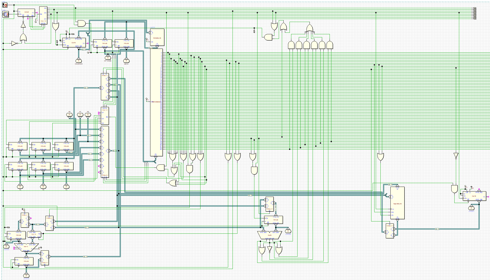

# Processeur

Processeur 16 bits créé par Mathieu Vaudeleau.  
16 bits processor created by Mathieu Vaudeleau.

Il peut être ouvert et utilisé en téléchargeant le logiciel Deeds electronic (gratuit)  
It can be opened and used by downloading the Deeds electronic software (free)  
https://www.digitalelectronicsdeeds.com/

